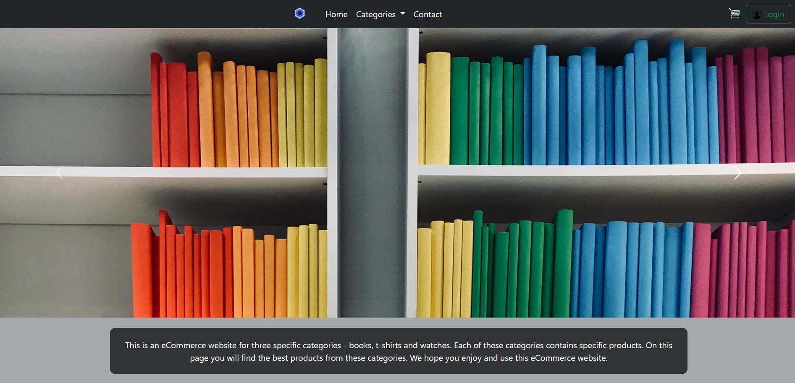
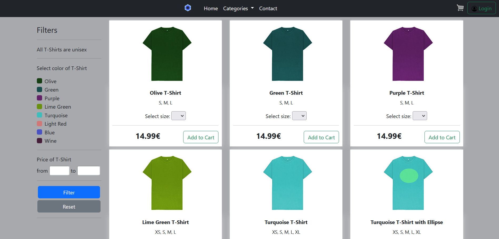
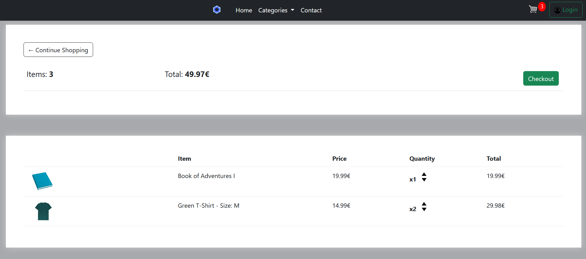

# eCommerce - Web Application

This project is eCommerce web application. This web application was created using Python(Django framework), JavaScript, HTML(Django template), CSS and Bootstrap 5.3

This is also responsive web application. On this web application user can do:

### Functions
 - create account
 - login and logout
 - add product into cart
	  - can use filters
 - remove product from cart
 - create order
 - change information about user, only logged user
 - see created orders, only logged user

### How to run website
1. go to folder where is manage.py file
2. run command in terminal - python manage.py runserver

## Screenshot of website

#### Main page

#### T-Shirt category

####Cart

